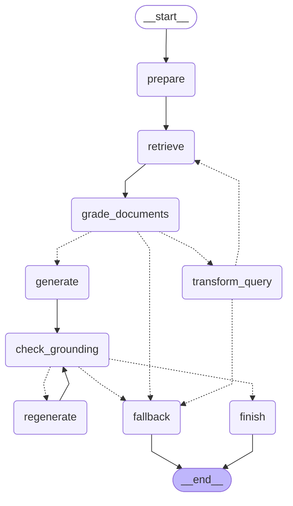

# Lab 6 – Đồ thị CRAG-lite

```mermaid
---
config:
  flowchart:
    curve: linear
---
graph TD;
	__start__([<p>__start__</p>]):::first
	prepare(prepare)
	retrieve(retrieve)
	grade_documents(grade_documents)
	transform_query(transform_query)
	generate(generate)
	check_grounding(check_grounding)
	regenerate(regenerate)
	finish(finish)
	fallback(fallback)
	__end__([<p>__end__</p>]):::last
	__start__ --> prepare;
	check_grounding -.-> fallback;
	check_grounding -.-> finish;
	check_grounding -.-> regenerate;
	generate --> check_grounding;
	grade_documents -.-> fallback;
	grade_documents -.-> generate;
	grade_documents -.-> transform_query;
	prepare --> retrieve;
	regenerate --> check_grounding;
	retrieve --> grade_documents;
	transform_query -.-> fallback;
	transform_query -.-> retrieve;
	fallback --> __end__;
	finish --> __end__;
	classDef default fill:#f2f0ff,line-height:1.2
	classDef first fill-opacity:0
	classDef last fill:#bfb6fc

```
